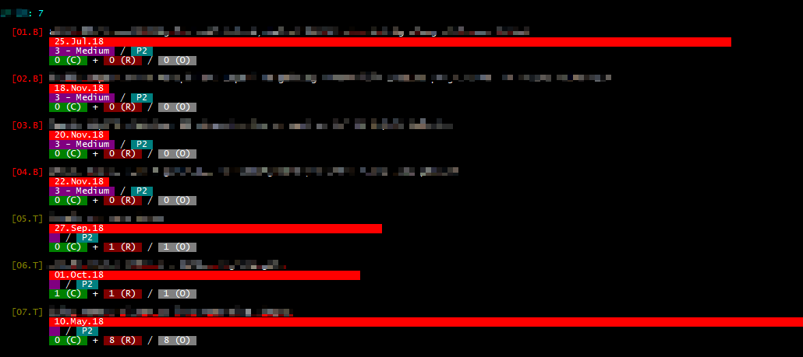

# `burner`
> **A FUN (`dotnet`) TOOL TO TRACK AZURE DEVOPS TASKS/BUGS BY USER!**



> [dotnet global tools](https://docs.microsoft.com/en-us/dotnet/core/tools/global-tools)

```bash
# Publish package to nuget.org
nuget push ./bin/burner.1.0.2.nupkg -ApiKey <key> -Source https://api.nuget.org/v3/index.json

# Install from nuget.org
dotnet tool install -g burner

# Install from local project path
dotnet tool install -g --add-source ./bin burner

# Uninstall
dotnet tool uninstall -g burner
```
