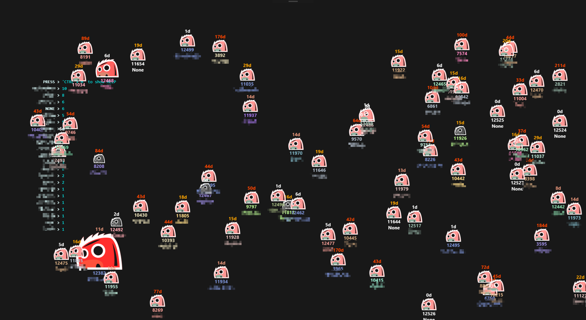

# `basher`
> **A FUN & ANIMATED BUG BASHING DASHBOARD!**

#### INSTALLATION
- Install [**`Basher.cer`**](Basher.cer) into **`Local Computer > Trusted Root ...`**
- Download the [**`Release package`**](https://github.com/vamsitp/basher/releases) and install it from an Elevated CMD

#### USAGE
- Update the mandatory fields marked with **`*`** in **`Preferences`** with VSTS (a.k.a. Azure DevOps) Account/Project details
- Lie back and enjoy!

> **VSTS - PERSONAL ACCESS TOKEN (PAT)**: https://your-team.visualstudio.com/_details/security/tokens 

#### CREDITS
- [MONSTER ICON](https://opengameart.org/content/enemy-game-character-dark-monster)
- [ROCKSTAR ANIMATION](https://gfycat.com/gifs/detail/FineLeadingElephant)
- [DINO LOGO](https://dribbble.com/shots/3064570-Unable-to-connect)
